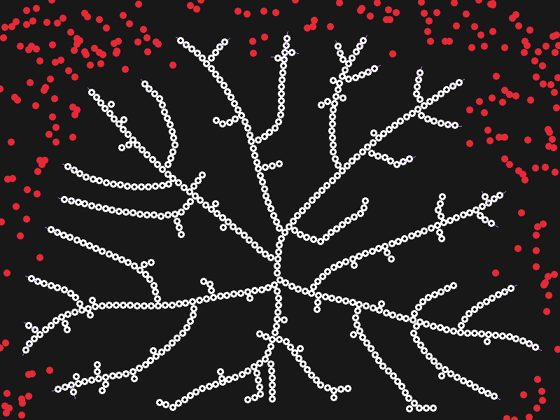

# Raylib Template

Implementation of ["Modeling and visualization of leaf venation patterns" paper](https://dl.acm.org/doi/10.1145/1073204.1073251).



## Quick Start

```console
$ cc -o nob nob.c
$ ./nob
$ ./main
```
